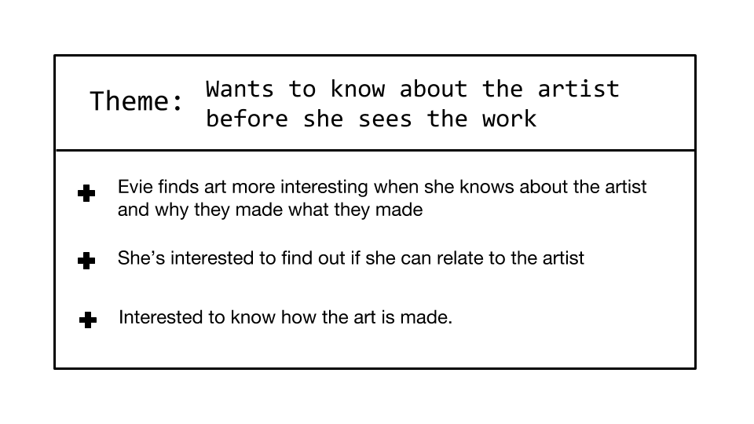

# art-investigator

Art, especially gallery art and museum art, can be hard to digest and alienating for children. The goal of Art Investigator is to make museum art understandable, relatable, and fun for children at an early reading age (7-11 years old). Working with Nick Cave's <i>Feat.</i> exhibit at The Frist Center for the Visual Arts  in Nashville, Tennessee, Art Investigator is an interactive tour through the exhibit that focuses on learning, emotional intelligence, and creating interaction points for parents and their children. 

<b>Primary Users</b>

My primary users are Evie and Jack, a first grader and third grader respectively,that are interested in art but often feel like they don’t relate to what they are seeing. They enjoy going to museums but feel like they could be more fun and interactive. 

The secondary users are Michelle and Jason, Evie and Jack’s parents. They love introducing their children to art and culture and want their kids to enjoy art. They like to visit museums on the weekend and are always looking for something memorable and fun to do as a family.

<b>Research Plan</b>

The primary user research was done working with a family of four with a daughter and son in the age early reading age range, two additional children in the age range, and a mother and daughter. Interviews were conducted to guage what interests the designated age range when visiting museums and art exhibits. These interviews also helped determine the emotional vs. vocabulary comprehension level as well as their familarility with technology usage. Observations were also conducted at The Adventure Science Center to understand what attracts early-reading-age children. 

Working with Early Childhood Education Teacher, Rebecca Sacramone, and K-12 Education Technology Professional at The Cleveland Institute of Music, Heather Young Mandujano,a lesson plan focusing on Nick Cave and his wide range of artistic mediums, and the related emotional intelligence of vulnerability was developed. Additionally, working with a designer from the Adventure Science Center in Nashville, Tennessee, Jim Savelyev, interaction points for parents and their children were constructed. 

<b>Themes & Insights</b>

<b>Challenge Statement</b>

How might I create an interactive and relatable experience that enables Evie to learn and understand a new art topic, build her vocabulary, and grow her emotional intelligence in a meaningful way - all while creating moments that allow for interaction between her and her Mother and still engaging her in a fun and interesting way. 

<b>Features</b>
    <ul>
        <li>User authentication through Google using Firebase</li>
        <li>Storybook style app that progresses the user through a storyline to engage them in the exhibit</li>
        <li>Relatibly and interactively informing the user about the exhibit before they enter</li>
        <li>Activities to engage in while walking through the exhibit</li>
        <li>User image upload using Firebase Storage Bucket</li>
    </ul>

<b>User Focused Goals</b>
    <ul>
        <li>Create an engaging and interactive way for the user to experience and understand art.</li>
        <li>Design a storybook style app that allows the user to be engaged in a linear way and not to feel like they are just reading the museum placards</li>
        <li>Foster realitibly and interactibility for the user to feel like they are a part of the process using relatibility as a way to create solid foundations for learning and emotional intelligence</li>
        <li>Focus the design on the user.</li>
        <li>Create User Authentication to save user acomplishments</li>
        <li>Build activities to engage users and eliminate monotony fatigue, allowing the user to focus on and digest the exhibit.</li>
        <li>Produce genuine interaction points between primary users and their guardians that teach vocabulary, emotional intelligence, and art.</li>
    </ul>

<b>Specifications</b>
    <ul>
        <li>Jquery</li>
        <li>CRUD - User Authentication with Firebase through Google</li>
        <li>Sass</li>
        <li>Firebase Storage Bucket</li>
        <li>Bootstrap</li>
        <li><a href="https://drive.google.com/drive/folders/1NdlC35gE0DVduwrlFMYoaEHncZHyaYX6">XD prototyping</a></li>
        <li>Photoshop Image Creation</li>
    </ul>

<b>MVP</b>
    <ul>
        <li>User authentication through Gmail using Firebase</li>
        <li>Saving and remembering a seperate username from the google profile for the primary user to feel connected to the app</li>
        <li>Bootstrap Styling for all applicable css styling</li>
        <li>Jquery</li>
        <li>Image Upload using Firebase Storage Bucket for user game play images</li>
        <li>Create a user focused interactive learning experience</li>
    </ul>

